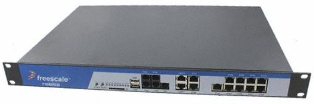

.. T1040 documentation master file

Welcome to T1040RDB documentation
=================================

:Version: 1.00A
:Copyright: (C)2016 Avnet Silica company
:Date: 26 Aug 2016
:Reference name: QorIQ T1040

QorIQ® T1040 Reference Design Board
-----------------------------------

*QorIQ T1040RDB Board*

.. index:: index

**INTRODUCTION**
----------------

The QorIQ® T1040 Reference Design Board is a high-performance computing evaluation, development and test platform for QorIQ T1040 communications processors built on Power Architecture® technology.

The boards, with 1.5 GHz T1040 processor and rich I/O mix, are for evaluation of QorIQ T1 in networking and Ethernet applications, such as mixed control and data plane in fixed routers, switches, Internet access devices, firewall and other packet-filtering applications, as well as general-purpose embedded computing.

The T1040RDB board can help shorten your time to market. It can be used for software development and performance evaluation prior to the customers’ own board being ready.

**Features**

- **Processor** QorIQ® T1040, 1.5 GHz core with 1600 MT/s DDR3L data rate
- Memory
    - 2GB unbuffered DDR3L SDRAM UDIMM/RDIMM (64-bit bus), 1600 MHz data rate
    - 128MB NOR Flash, 16-bit
    - 2GB SLC NAND Flash
    - SD Connector to Interface
    - SATA interface
- PCI Express
    - One x4 PCIe slot
    - Two Mini-PCIe connectors
- **USB 2.0** Dual USB slot, connected to USB PHY
- Ethernet
    - One onboard SGMII 10/100/1G Ethernet ports
    - Two onboard RGMII 10/100/1G Ethernet ports
    - Two onboard QSGMII 10/100/1G For 8 GE ports
- **Two UART** ports at up to 115200 bps
- **TDM** One FXO and Four FXS ports

Developement tools
******************

NXP releases Linux® SDK for QorIQ® Processors including support for QorIQ® T1040 ARM-based with Yocto system.

**Features**

- Linux kernel and device drivers
- Yocto Embedded Linux development environment
- GNU tools (compilers, linkers, etc.)
- Bootloaders and firmware
- Libraries and middleware
- Reference applications
- Linux root filesystem
- Deployment mechanisms

Document references
*******************

The board reference documentation is available on the `NXP website <http://www.nxp.com/products/microcontrollers-and-processors/power-architecture-processors/qoriq-processors-power-architecture-t-series/qoriq-t1040-reference-design-board:T1040RDB?fpsp=1&tab=Documentation_Tab>`_ website. 

Contents:

.. toctree::
   :maxdepth: 2

   qs
   uboot

