.. index:: qs

.. _quick:

Quick start guide
-----------------

This document will guide you from installing the **Linux® SDK 1.7 for QorIQ® Processors of NXP** on a Ubuntu **14.04** and build all the files necessary to run the board. It's a simple guide "ready to go" in order to be able to create your own Linux distribution from scratch reading this only page.
The binaries generated will be installed in the NOR flash of the board. The Yocto Project is used in this SDK, this is an open source collaboration project that provides templates, tools and methods to help you create custom Linux-based systems for embedded boards products. At the end of the next steps you will have a linux system ready to boot on your board **T1040RDB**.

The first step to do is preparing on the host machine a linux operating system. In this guide we have used a virtual machine in order to develop on the SDK. So the first step is installing a virtual machine with **Ubuntu 14.04 32bit**.

Download VirtualBox
===================

.. image:: _static/vdi_virtualbox_logo.png

If you don't know any virtual machine, we will explain here where download one of them and how to install Ubuntu 14.04 32bit.
We have used **VirtualBox**, you can get VirtualBox installer from here:

https://www.virtualbox.org/wiki/Downloads

Download the version that suits your host operating system. You need to download and install the **Extension Pack** as well.

.. important::

 Make sure that the extension pack has the same version of VirtualBox.

Install the software with all the default options. 

Create a new Virtual Machine
============================

Create the VirtualBox image clicking on **New** button.

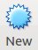

Insert a name, for example **T1040-SDK**. Select **Linux**, **Ubuntu (32-bit)**

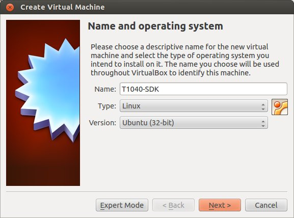

Allocate memory resource for the virtual machine, it is important have at least 2GB.

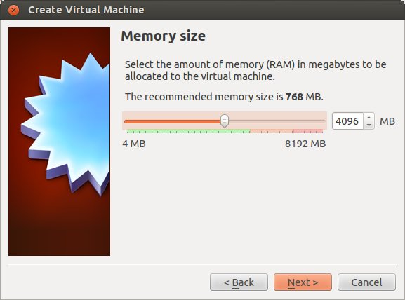

Create a virtual hard disk.

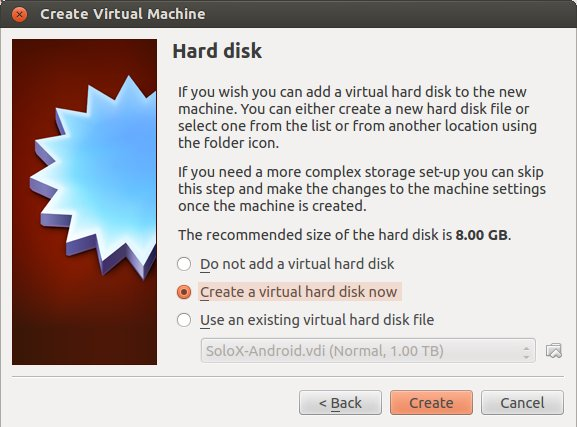

Select VirtualBox Disk Image:

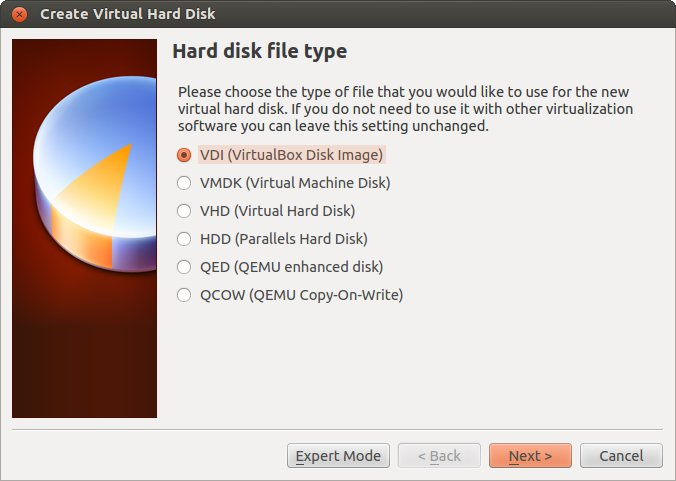

Click on dynamic allocation, this permit to save space unused

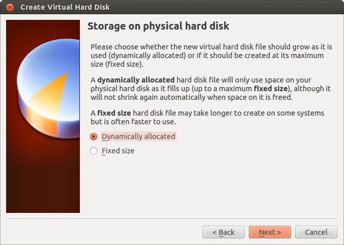

Choose a big size for the hard disk because Yocto uses a lot of space during the building of the distribution. Clicking on the folder icon you can choose where store the hard disk image.

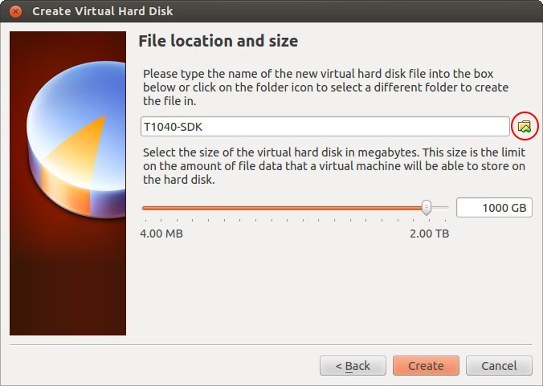

After this steps the Virtual Machine will be created and you have to open the settings window in order to increase the performances of your virtual machine. First, select the **T1040-SDK** virtual machine from the list of virtual machines, click on the  **Settings** icon in the **Oracle VM VirtualBox Manager** window:

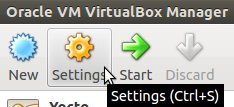

Select *Processor* tab to select how many processor **cores** you want to assign to the virtual machine.

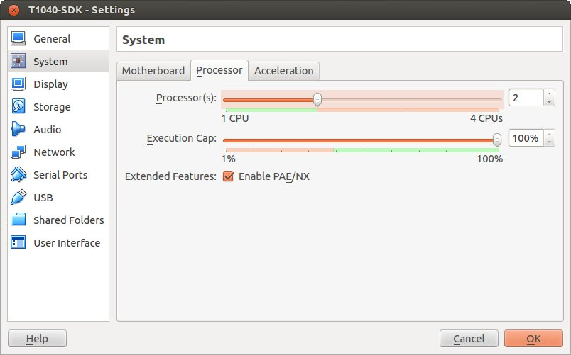

Click on **Shared Folders** and select a folder to share with your host operating system. Make sure that **Auto-mount** check-box is checked.

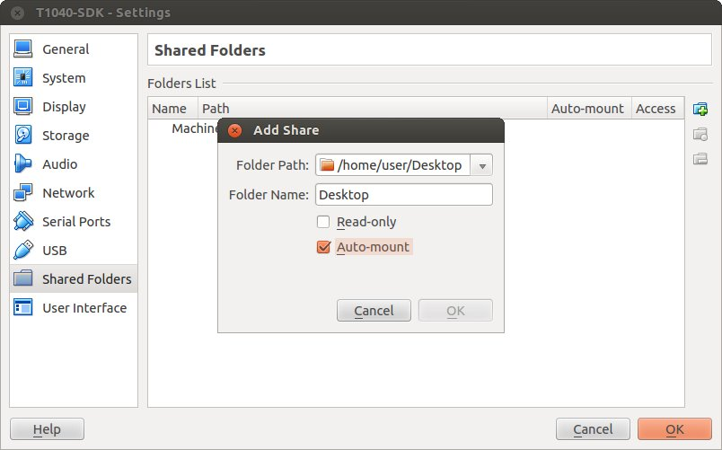

Install Ubuntu 14.04 32bit
==========================

Download the ISO from `Ubuntu website <http://releases.ubuntu.com/14.04/ubuntu-14.04.5-desktop-i386.iso>`_.
After the download, in the settings select **Storage** then click on the CD icon named **Empty**, click on the CD icon on the right and choose the Ubuntu iso image **ubuntu-14.04.5-desktop-i386.iso** via **Choose a virtual optical disk file** option.

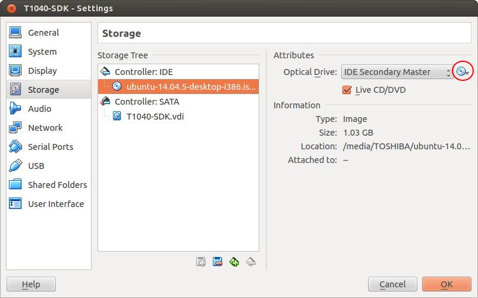

Click on **Ok** button. Then start the virtual machine:

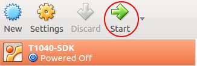

When you are running Ubuntu Live System with Installation Wizard, choose your language and click "Install Ubuntu" button.

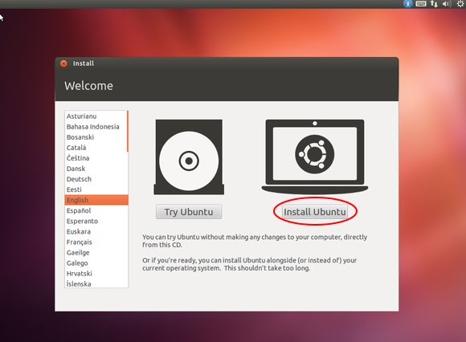

Skip "Downloads update while installing" and "install this third-part software" and click on **continue** button.

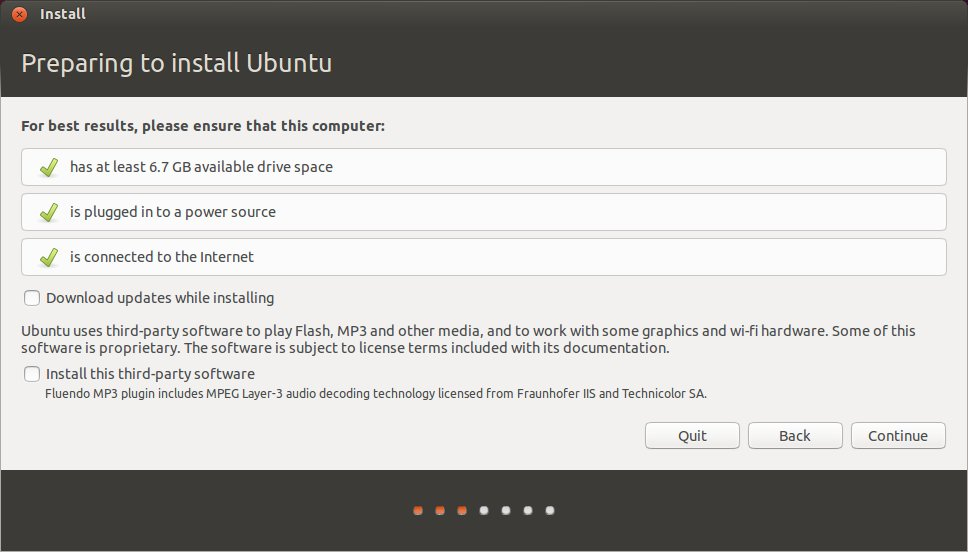

Select **Erase disk and install Ubuntu** and click on **Install Now**

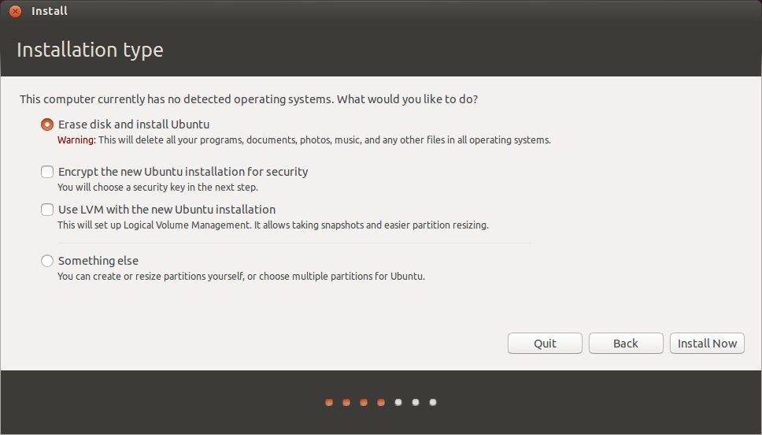

Continue the installation confirming your chose and set your time zone. After the selecting keyboard window you will have to insert **User Name** and **Password**. We have used these data:

- user: **architech**
- computer's name: **architech**
- password: **architech**
- log in automatically checked

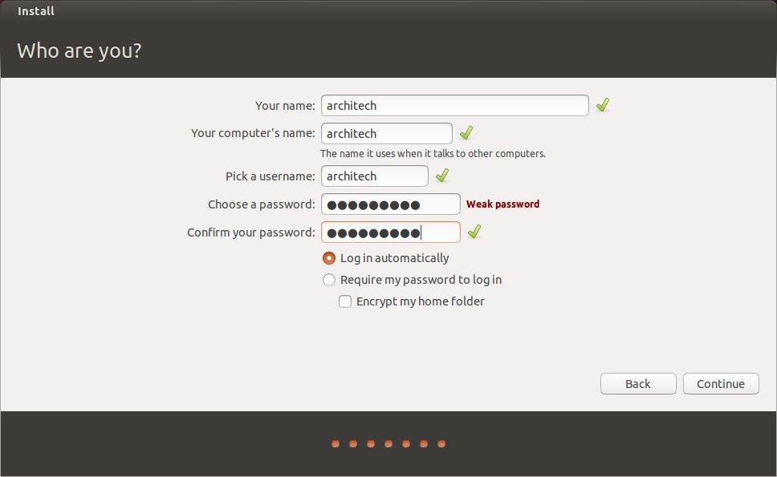

Press continue and wait the end of the installation. 
Remember to remove the virtual CD, you have to open the setting window of the T1040-SDK machine and **remove the storage from the CD** icon marked in red.

Once the virtual machine is ready, start the virtual machine 

If a window will appear asking to upgrade Ubuntu, select **Don't Upgrade**.

.. image:: _static/vbox_upgrade.jpg

Before to start the installation of the SDK it is better install the Guest Addition, click on **Devices** -> **Insert Guest Additions CD image...**

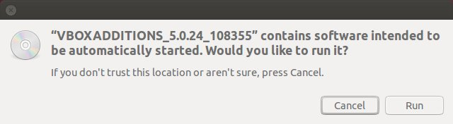

Click on **Run** button and install the addons. It is required the password for root privilege, in our example is **architech**.
Now open a terminal and use this command

::

  sudo adduser architech vboxsf

where **architech** is your username. Reboot the virtual machine.

Download SDK 1.7
================

The next step is to install the **Linux® SDK for QorIQ® Processors of NXP**. After the registration on their website you can download the SDK from `this page <http://www.nxp.com/products/software-and-tools/run-time-software/linux-sdk/linux-sdk-for-qoriq-processors:SDKLINUX>`_.
Clicking on **Download** button.

.. image:: _static/download_website.jpg

Then you have to click on **previous** tab and on **QorIQ Linux SDK v1.7** link. We are using a previous version because the newest version doesn't support the **T1040RDB** board anymore.

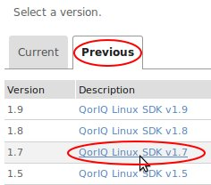

There will be shown you a list of images, you have to download the file **Source: QorIQ Linux SDK V1.7 Yocto Source ISO**, size 3.1GB. The other links are  binary files, these are useless for us because we will build the Linux distribution by ourself.

If you have downloaded the ISO file without the Virtual Machine then use the shared folder created previously in order to import the file.

Installation
============

Following these steps you will install the SDK in short time:

1. Open a terminal and move into the directory where there is the ISO image file, then use these commands:

::

 mkdir iso
 sudo mount -o loop "QorIQ Linux SDK V1.7 Yocto Source ISO.iso" iso

.. note::

 In this iso there is the **START_HERE.html** file, this is the **official SDK** guide. Use this guide to go further in details about the SDK and its features.

2. Configure **/etc/sudoers** file:

::

  sudo visudo /etc/sudoers

add the following line in the User Privilege section:

::

  architech ALL = NOPASSWD: /usr/bin/apt-get

3. Install the SDK using all the deault options. This procedure will require some hours:

::

 cd iso
 ./install
 cd ~/QorIQ-SDK-V1.7-20141218-yocto
 ./poky/scripts/host-prepare.sh
 source ./poky/fsl-setup-poky -m t1040rdb-64b -j 4

The option **-j 4** is used to tell Bitbake how many tasks can be executed at the same time. These are related to the number of processors of your (virtual) machine, and should be set with a number that is two times the number of processors on your (virtual) machine. If for example, your (virtual) machine has/sees 2 cores, then you should set those variables with the number **4**.

Now you have the Yocto installed and ready to build a Linux distribution. Every time you will want build a Linux distribution using Yocto you will have to open a terminal and enter the following commands:

::

 cd ~/QorIQ-SDK-V1.7-20141218-yocto/build_t1040rdb-64b_release/
 source ./SOURCE_THIS

In this way you will have the build environment ready.
Finally Remember to unmount the image with the command:

::

  umount <PATH_TO_THE_ISO>/iso

Build Linux Distribution
========================

Supposing you are using a terminal and you are in the *~/QorIQ-SDK-V1.7-20141218-yocto/build_t1040rdb-64b_release/* directory with the Yocto environment ready to build, you can choose which Linux distribution you want compile. The possibility are:

- **fsl-image-minimal**: contains basic packages to boot up a board
- **fsl-image-core**: contains common open source packages and FSL specific packages.
- **fsl-image-full**: contains all packages in the full package list.
- **fsl-image-flash**: contains all the user space apps needed to deploy the fsl-image-full image to a USB stick, hard drive, or other large physical media.
- **fsl-image-virt**: contains toolkit to interact with the virtualization capabilities of Linux
- **fsl-image-x11**: freescale image with a very basic X11 image with a terminal

In our guide we have built the **fsl-image-minimal**. This distribution is very minimal and it is used just to have a system running with essential services. It does not contain Freescale special SDK packages such as USDPAA, etc.
So running the next command Yocto will start to download from internet and compile all the packages necessary to create the distribution. For this reason it is mandatory have a internet connection available or the building will fail.

::

 bitbake fsl-image-minimal

This task will require a lot of time, few hours. If there will be problems, the first thing is to check the internet connection and the space available on the virtual machine.

Flashing the Linux Distribution
===============================

When the compiling is finished you have the binary files in the directory *~/QorIQ-SDK-V1.7-20141218-yocto/build_t1040rdb-64b_release/tmp/deploy/images/t1040rdb-64b/*, this directory will look like this one:

.. image:: _static/built_directory.jpg

In this directory these files corrispond to:

- the **bootloader** named **u-boot**
- the **microcode binaries** named **fsl_fman_ucode**
- the **Reset Configuration Word** named **rcw_1400MHz**, you can find them in rcw/RR_P_66 folder.
- the **Linux kernel** named **uImage**
- the **Device Tree** named **uImage-t1040rdb.dtb**
- the **root file system** named **fsl-image-minimal-t1040rdb-64b**

Now we have to upload these files into the NOR flash. The easy way to do this is running the bootloader **u-boot** pre-installed on the T1040RDB and using a TFTP server on the host machine permitting to the u-boot to download the files and upload them into the NOR flash.

Installing the TFTP server
==========================

In the virtual machine install following packages:

::

 sudo apt-get install xinetd tftpd tftp

Create /etc/xinetd.d/tftp file

::

 sudo nano /etc/xinetd.d/tftp

and put this entry:

::

 service tftp
 {
 protocol        = udp
 port            = 69
 socket_type     = dgram
 wait            = yes
 user            = nobody
 server          = /usr/sbin/in.tftpd
 server_args     = /home/<ENTER YOUR HOME NAME>/QorIQ-SDK-V1.7-20141218-yocto/build_t1040rdb-64b_release/tmp/deploy/images/t1040rdb-64b
 disable         = no
 }

and change the properties of the **t1040rdb-64b** directory.

::

 sudo mkdir /home/<ENTER YOUR HOME NAME>/QorIQ-SDK-V1.7-20141218-yocto/build_t1040rdb-64b_release/tmp/deploy/images/t1040rdb-64b
 sudo chmod -R 777 /home/<ENTER YOUR HOME NAME>/QorIQ-SDK-V1.7-20141218-yocto/build_t1040rdb-64b_release/tmp/deploy/images/t1040rdb-64b
 sudo chown -R nobody /home/<ENTER YOUR HOME NAME>/QorIQ-SDK-V1.7-20141218-yocto/build_t1040rdb-64b_release/tmp/deploy/images/t1040rdb-64b

Restart the xinetd service.

::

 sudo /etc/init.d/xinetd restart

You must allow udp port 69 in firewall.

We need change the configuration for the network from the setting of the virtual machine, shut down Ubuntu and click on settings button:

Go in the network settings and change the connection to: **Bridged Adapter**

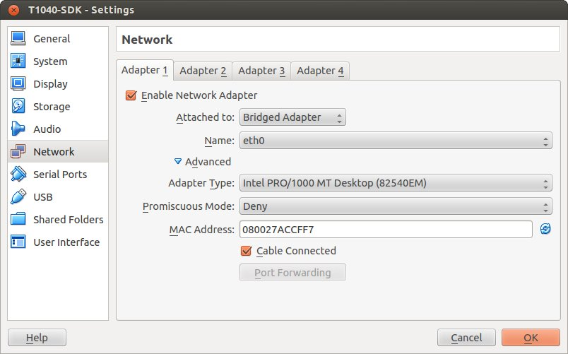

Turn on the vitual machine and an important thing to do is to set the IP address of the virtual machine as static. To do this follow the next steps inside the virtual machine:

1. Right-click on network connection icon. Select *Edit Connections...*.

2. In *Wired* tab, select *Auto eth0* and press *Edit...* button.

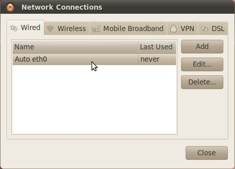

3. Click to *IPv4 Settings*, click on *Add* button and insert the following address:

* *Address*: 192.168.2.1

* *Netmask*: 255.255.255.0

Leave *Gateway* empty.

4. Click on Apply.

.. warning::

  this setting make your virtual machine not connected to the internet, so if you want rebuild another image from yocto you have to reset the network settings as before the change.

Flash the NOR
=============

Reading from the official SDK guide, the NOR flash on the board can be seen as two flash banks. The board DIP switch configuration (for T1040RDB, SW3[5:7]) preselects bank 0 as the hardware default bank.

To protect the default U-Boot in bank 0, it is a convention employed by Freescale to deploy work images into the alternate bank, and then switch to the alternate bank for testing. Switching to the alternate bank can be done in software and effectively swaps the first bank with the second bank, thereby putting the alternate bank in the bank 0 address range until further configuration or until a reset occurs. This protects banks 0 and keeps the board bootable under all circumstances.

So we will boot the system from the bank 0 but we will write our files into the **bank 4**. In this way if something goes wrong we have the bank 0 with a bootable system. The area of the flash memory where we put our compiled file are the following:

+-------------+------------+---------------------------------------+---------------+
| Range Start | Range End  | Definition                            | Size          |
+-------------+------------+---------------------------------------+---------------+
| 0xebf40000  | 0xebffffff | U-Boot (alternate bank)               | 768 KB        |
+-------------+------------+---------------------------------------+---------------+
| 0xec800000  | 0xec8fffff | Hardware device tree (alternate bank) | 1 MB          |
+-------------+------------+---------------------------------------+---------------+
| 0xec000000  | 0xec01ffff | RCW (alternate bank)                  | 128 KB        |
+-------------+------------+---------------------------------------+---------------+
| 0xebf00000  | 0xebf0ffff | FMAN Ucode (alternate bank)           | 64 KB         |
+-------------+------------+---------------------------------------+---------------+
| 0xec800000  | 0xec8fffff | Hardware device tree (alternate bank) | 1 MB          |
+-------------+------------+---------------------------------------+---------------+
| 0xec020000  | 0xec7fffff | Linux.uImage (alternate bank)         | 7 MB + 875 MB |
+-------------+------------+---------------------------------------+---------------+

Here the steps for upload the files:

1. Connect the UART cable from the T1040RDB **UART0** port and your PC. 

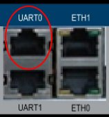

Open a terminal and launch **minicom**

::

 sudo minicom -ws

If minicom is not installed, you can install it with:

::

 sudo apt-get install minicom

then you can setup your port with these parameters:

::

    +-----------------------------------------------------------------------+
    | A -    Serial Device      : /dev/ttyS0                                |
    | B - Lockfile Location     : /var/lock                                 |
    | C -   Callin Program      :                                           |
    | D -  Callout Program      :                                           |
    | E -    Bps/Par/Bits       : 115200 8N1                                |
    | F - Hardware Flow Control : No                                        |
    | G - Software Flow Control : No                                        |
    |                                                                       |
    |    Change which setting?                                              |
    +-----------------------------------------------------------------------+
            | Screen and keyboard      |
            | Save setup as dfl        |
            | Save setup as..          |
            | Exit                     |
            | Exit from Minicom        |
            +--------------------------+

If on your system the device has not been recognized as **/dev/ttyS0**, just replace **/dev/ttyXXX**
with the proper device.

Once you are done configuring the serial port, you are back to *minicom* main menu and you can select *exit*.

2. Power on the board and press a key in order to enter in the command line of the u-boot.

::

 U-Boot 2014.01-00004-g6cefa6e (Aug 28 2014 - 14:16:01)
 
 CPU0:  T1040E, Version: 1.1, (0x85280011)
 Core:  e5500, Version: 2.1, (0x80241021)
 Clock Configuration:
        CPU0:1400 MHz, CPU1:1400 MHz, CPU2:1400 MHz, CPU3:1400 MHz,
        CCB:600  MHz,
        DDR:800  MHz (1600 MT/s data rate) (Asynchronous), IFC:150  MHz
        QE:300  MHz
        FMAN1: 600 MHz
        QMAN:  300 MHz
        PME:   300 MHz
 L1:    D-cache 32 KiB enabled
        I-cache 32 KiB enabled
 Reset Configuration Word (RCW):
        00000000: 0c18000e 0e000000 00000000 00000000
        00000010: 66000002 80000002 ec027000 01000000
        00000020: 00000000 00000000 00000000 00032810
        00000030: 00000000 0342500f 00000000 00000000
 Board: T1040RDB
 Board rev: 0x01 CPLD ver: 0x06, vBank: 0
 ... more booting messages ...
 Hit any key to stop autoboot:  0 
 => 

3. Connect the ethernet cable from the board to the PC. 

.. image:: _static/eth0.jpg

Check ethernet connection, by default the u-boots sets its IP to **192.168.2.105** and the server **192.168.2.1**. Try to ping from the board to the PC:

::

 => ping 192.168.2.1
 Using FM1@DTSEC4 device
 host 192.168.2.1 **is alive**

If all is ok the response will be **is alive** otherwise try to check the firewall on your PC.

4. Upload the **U-BOOT**:

::

 tftp 0x1000000 u-boot-T1040RDB.bin
 protect off 0xebf40000 +$filesize
 erase 0xebf40000 +$filesize
 cp.b 0x1000000 0xebf40000 $filesize
 protect on 0xebf40000 +$filesize

5. Upload the **RCW**:

::

 tftp 0x1000000 rcw/RR_P_66/rcw_1400MHz.bin
 protect off 0xec000000 +$filesize
 erase 0xec000000 +$filesize
 cp.b 0x1000000 0xec000000 $filesize
 protect on 0xec000000 +$filesize

6. Upload the microcode **FMAN**. The file to choose depends on the version type of the T1040 processor. From the official guide you can read: There are microcode binaries for the Frame Manager hardware block that is in QorIQ products. Specific platforms require specific binaries, and those also have to match specific software versions (i.e., match Frame Manager Driver version). See the U-Boot log for T1040 version information (e.g., T1040E version 1.0) and also for the version of FMan microcode currently flashed on the T1040RDB (e.g. microcode version 106.4.14). For QorIQ SDK 1.7, one of the following FMan microcode binaries should be used:

For silicon revision 1.0:

::

  fsl_fman_ucode_t1040_r1.0_106_4_14.bin
  fsl_fman_ucode_t1040_r1.0_107_4_2.bin

For silicon revision 1.1:

::

  fsl_fman_ucode_t1040_r1.1_106_4_14.bin
  fsl_fman_ucode_t1040_r1.1_107_4_2.bin

So, seeing on the u-boot you can see directly which version is loaded in the NOR. In our case it was:

::

 ...
 Firmware 'Microcode version 0.0.1 for T1040 r1.0' for 1040 V1.0
 ...
 Fman1: Uploading microcode version 106.4.14

In this case (r1.0, 106.4.14) the commands will be:

::

 tftp 0x1000000 fsl_fman_ucode_t1040_r1.0_106_4_14.bin
 protect off 0xEBF00000 +$filesize
 erase 0xEBF00000 +$filesize
 cp.b 0x1000000 0xEBF00000 $filesize
 protect on 0xEBF00000 +$filesize

7. We don't upload in the NOR the Linux kernel, device tree and the root filesystem because if we will build another distribution we will be free to change it without using the flash memory. So the idea is download them from the TFTP server into the RAM and launch them directly from there. The first thing to do now is reboot the T1040RDB using the bank 4. To do this is necessary launch this command from the u-boot:

::

 cpld reset altbank

Then we will upload the file necessary and set a boot variable:

::

  setenv bootargs "root=/dev/ram rw console=ttyS0,115200 ramdisk_size=700000"
  tftp 0x1000000 uImage-t1040rdb-64b.bin
  tftp 0x2000000 fsl-image-minimal-t1040rdb-64b.ext2.gz.u-boot
  tftp 0x3000000 uImage-t1040rdb.dtb

As you can see the correct roof file system is with the postfix **.ext2.gz.u-boot**. With the next command you will launch the Linux Operating System:

::

 bootm 0x1000000 0x2000000 0x3000000

The boot of the kernel will show you a screen like this one:

::

  => bootm 0x1000000 0x2000000 0x3000000
  ## Booting kernel from Legacy Image at 01000000 ...
    Image Name:   Linux-3.12.19-rt30-QorIQ-SDK-V1.
    Image Type:   PowerPC Linux Kernel Image (gzip compressed)
    Data Size:    5123563 Bytes = 4.9 MiB
    Load Address: 00000000
    Entry Point:  00000000
    Verifying Checksum ... OK
  ## Loading init Ramdisk from Legacy Image at 02000000 ...
    Image Name:   fsl-image-minimal-t1040rdb-64b-2
   Image Type:   PowerPC Linux RAMDisk Image (gzip compressed)
     Data Size:    3312699 Bytes = 3.2 MiB
    Load Address: 00000000
    Entry Point:  00000000
    Verifying Checksum ... OK
  ## Flattened Device Tree blob at 03000000
    Booting using the fdt blob at 0x3000000
    Uncompressing Kernel Image ... OK
    Loading Ramdisk to 2fcd7000, end 2ffffc3b ... OK
    Loading Device Tree to 03fe4000, end 03fffb65 ... OK
  Warning: MAC address for l2switch not found
  Using CoreNet Generic machine description
  MMU: Supported page sizes
          4 KB as direct
       1024 KB as direct
       2048 KB as direct
       4096 KB as direct
      16384 KB as direct
      65536 KB as direct
     262144 KB as direct
    1048576 KB as direct
  MMU: Book3E HW tablewalk not supported
  Found initrd at 0xc00000002fcd7000:0xc00000002ffffc3b
  No /soc@ffe000000/qman@318000 property 'fsl,qman-fqd', using memblock_alloc(0000000000400000)
  No /soc@ffe000000/qman@318000 property 'fsl,qman-pfdr', using memblock_alloc(0000000002000000)
  Qman ver:0a01,03,01,03
  No /soc@ffe000000/bman@31a000 property 'fsl,bman-fbpr', using memblock_alloc(0000000001000000)
  Bman ver:0a02,02,01
  pme: No /soc@ffe000000/pme@316000 property 'fsl,pme-pdsr', using memblock_alloc(0x0000000001000000)
  pme: No /soc@ffe000000/pme@316000 property 'fsl,pme-sre', using memblock_alloc(0x0000000000a00000)
  No USDPAA memory, no 'usdpaa_mem' bootarg
  bootconsole [udbg0] enabled
  CPU maps initialized for 1 thread per core
  Starting Linux PPC64 #1 SMP Mon Aug 22 23:43:34 BST 2016
  -----------------------------------------------------
  ppc64_pft_size                = 0x0
  physicalMemorySize            = 0x80000000
  ppc64_caches.dcache_line_size = 0x40
  ppc64_caches.icache_line_size = 0x40
  -----------------------------------------------------
   <- setup_system()
  Linux version 3.12.19-rt30-QorIQ-SDK-V1.7+g6619b8b (architech@architech) (gcc version 4.8.1 (GCC) ) #1 SMP Mon Aug 22 23:43:34 BST 2016
  ...
  ...
  Poky (Yocto Project Reference Distro) 1.6.1 t1040rdb /dev/ttyS0
  t1040rdb login:

The booting process finish with the login **t1040rdb login:**. Enter **root** as username, it is not required any password. Will be showed the shell:

::

  root@t1040rdb:~#

Boot directly with Bank 4
=========================

If you want run directly the u-boot from the bank 4 when you turn-on the T1040RDB then you have to change its switch. This is the configuration:

SW3 pin 5 -> OFF, with this set the boot starts from Bank **4**.

Default switches:

+-----+-----+-----+-----+-----+-----+-----+-----+-----+
|     |  1  |  2  |  3  |  4  |  5  |  6  |  7  |  8  |
+-----+-----+-----+-----+-----+-----+-----+-----+-----+
| SW1 | ON  | ON  | ON  | OFF | ON  | ON  | OFF | OFF |
+-----+-----+-----+-----+-----+-----+-----+-----+-----+
| SW2 | OFF | ON  | OFF | OFF | OFF | ON  | OFF | OFF |
+-----+-----+-----+-----+-----+-----+-----+-----+-----+
| SW3 | OFF | OFF | OFF | ON  | ON  | ON  | ON  | OFF |
+-----+-----+-----+-----+-----+-----+-----+-----+-----+

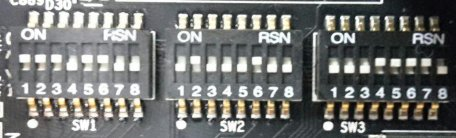

Changing the **SW3 pin 5**:

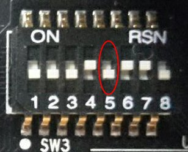

At the boot will be showd this screen:

::

 U-Boot 2014.01-00004-g6cefa6e (Aug 28 2014 - 14:16:01)
 
 CPU0:  T1040E, Version: 1.1, (0x85280011)
 Core:  e5500, Version: 2.1, (0x80241021)
 Clock Configuration:
        CPU0:1400 MHz, CPU1:1400 MHz, CPU2:1400 MHz, CPU3:1400 MHz,
        CCB:600  MHz,
        DDR:800  MHz (1600 MT/s data rate) (Asynchronous), IFC:150  MHz
        QE:300  MHz
        FMAN1: 600 MHz
        QMAN:  300 MHz
        PME:   300 MHz
 L1:    D-cache 32 KiB enabled
        I-cache 32 KiB enabled
 Reset Configuration Word (RCW):
        00000000: 0c18000e 0e000000 00000000 00000000
        00000010: 66000002 80000002 ec027000 01000000
        00000020: 00000000 00000000 00000000 00032810
        00000030: 00000000 0342500f 00000000 00000000
 Board: T1040RDB
 Board rev: 0x01 CPLD ver: 0x06, vBank: 4
 ... more booting messages ...
 Hit any key to stop autoboot:  0 

As you can see the booting message "Board rev: 0x01 CPLD ver: 0x06, **vBank: 4**" shows boot from Bank number 4.

