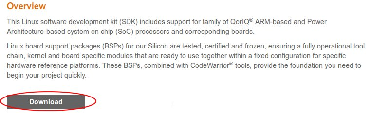
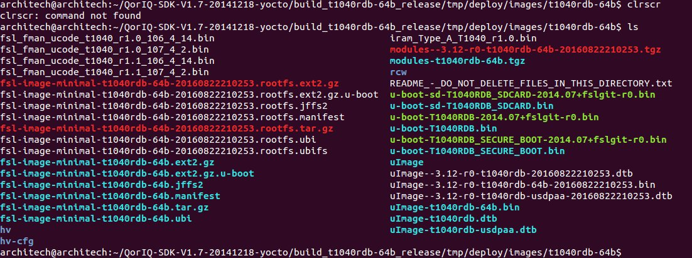
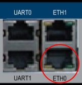

.. index:: qs

.. _quick:

Quick start guide
-----------------

This document will guide you from installing the **Linux® SDK 1.7 for QorIQ® Processors of NXP** on a Ubuntu **14.04** and build all the files necessary to run the board. It's a simple guide "ready to go" in order to be able to create your own Linux distribution from scratch reading this only page.
The binaries generated will be installed in the NOR flash if the board. The Yocto Project is used in this SDK, this is an open source collaboration project that provides templates, tools and methods to help you create custom Linux-based systems for embedded boards products. In few steps you will have a linux system ready to boot on your board.

The first step to do is preparing on the host machine a linux operating system. In this guide we have used a virtual machine in order to develop on the SDK. So the first step is installing a virtual machine (VirtualBox or VMWare) with Ubuntu 14.04.

Download SDK 1.7
================

Once the virtual machine is ready the next step is to install the **Linux® SDK for QorIQ® Processors of NXP**. After the registration on their website you can download the SDK from `this page <http://www.nxp.com/products/software-and-tools/run-time-software/linux-sdk/linux-sdk-for-qoriq-processors:SDKLINUX>`_.
Clicking on **Download** button.

Then you have to click on **previous** tab and on **QorIQ Linux SDK v1.7** link. We are using a previous version because the newest version doesn't support the **T1040RDB** board anymore.

There will be shown you a list of images, you have to download the file **Source: QorIQ Linux SDK V1.7 Yocto Source ISO**, size 3.1GB. The other links are pregenerated binary files, these are useless for us because we will build the linux distribution by ourself.

Once the download is complete import the image file into the virtual machine.

Installation
============

Following these steps you will install the SDK in short time:

1. Open a terminal and move into the directory where there is the ISO image file, then use these commands:

::

 mkdir iso
 sudo mount -o loop "QorIQ Linux SDK V1.7 Yocto Source ISO.iso" iso

.. note::

 In this iso there is the **START_HERE.html** file, this is the **official SDK** guide. Use this guide to go further in details about the SDK and its features.

2. Install the SDK using all the default options:

::

 cd iso
 ./install
 cd ~/QorIQ-SDK-V1.7-20141218-yocto
 ./poky/scripts/host-prepare.sh
 fsl-setup-poky -m t1040rdb-64b -j **4**
 . /home/architech/QorIQ-SDK-V1.7-20141218-yocto/poky/fsl-setup-poky -m t1040rdb-64b -j **4**

The option **-j 4** is used to tell Bitbake how many tasks can be executed at the same time. These are related to the number of processors of your (virtual) machine, and should be set with a number that is two times the number of processors on your (virtual) machine. If for example, your (virtual) machine has/sees 2 cores, then you should set those variables with the number **4**.

Now you have the Yocto installed and ready to build a Linux distribution. Everytime you will want build a linux distribution using Yocto you will have to open a terminal and enter the following commands:

::

 cd ~/QorIQ-SDK-V1.7-20141218-yocto/build_t1040rdb-64b_release/
 source ./SOURCE_THIS

In this way you will have the build environment ready.

Build Linux Distribution
========================

Supposing you are using a termianl and you are in the *~/QorIQ-SDK-V1.7-20141218-yocto/build_t1040rdb-64b_release/* directory with the Yocto environment ready to build, you can choose which Linux distribution you want compile. The possibility are:

::

 fsl-image-minimal: contains basic packages to boot up a board
 fsl-image-core: contains common open source packages and FSL specific packages.
 fsl-image-full: contains all packages in the full package list.
 fsl-image-flash: contains all the user space apps needed to deploy the fsl-image-full image to a USB stick, hard drive, or other large physical media.
 fsl-image-virt: contains toolkit to interact with the virtualization capabilities of Linux
 fsl-image-x11: freescale image with a very basic X11 image with a terminal

In our guide we have built the **fsl-image-minimal**. This distribution is very minimal and it is used just to have a system running with essential services. It does not contain Freescale special SDK packages such as USDPAA, etc.
So running the next command Yocto will start to download from internet and compile all the packages necessary to create the distribution. For this reason it is mandatory have a internet connection avaiable or the building will fail.

::

 bitbake fsl-image-minimal

This task will require a lot of time, few hours. If there will be problems, the first thing to check is the internet connection and the space avaiable on the virtual machine.

Flashing the Linux Distribution
===============================

When the compiling is finished you have the binary files in the directory *~/QorIQ-SDK-V1.7-20141218-yocto/build_t1040rdb-64b_release/tmp/deploy/images/t1040rdb-64b/*, this directory will look like this one:

In this directory these files corrispond to:
- the **bootloader** named **u-boot**
- the **microcode binaries** named **fsl_fman_ucode**
- the **Reset Configuration Word** named **rcw_1400MHz**, you can find them in rcw/RR_P_66 folder.
- the **Linux kernel** named **uImage**
- the **Device Tree** named **uImage-t1040rdb.dtb**
- the **root file system** named **fsl-image-minimal-t1040rdb-64b**

Now we have to upload these files into the NOR flash. The easy way to do this is run the bootloader **u-boot** preinstalled on the T1040RDB and using a TFTP server on the host machine permitting to the u-boot to download the files and upload them into the NOR flash.

Installing the TFTP server
==========================

In the virtual machine install following packages:

::

 sudo apt-get install xinetd tftpd tftp

Create /etc/xinetd.d/tftp

::

 sudo nano /etc/xinetd.d/tftp

and put this entry:

::

 service tftp
 {
 protocol        = udp
 port            = 69
 socket_type     = dgram
 wait            = yes
 user            = nobody
 server          = /usr/sbin/in.tftpd
 server_args     = /home/**ENTER YOUR HOME NAME**/QorIQ-SDK-V1.7-20141218-yocto/build_t1040rdb-64b_release/tmp/deploy/images/t1040rdb-64b
 disable         = no
 }

and change the properties of the **t1040rdb-64b** directory.

::

 sudo mkdir /home/**ENTER YOUR HOME NAME**/QorIQ-SDK-V1.7-20141218-yocto/build_t1040rdb-64b_release/tmp/deploy/images/t1040rdb-64b
 sudo chmod -R 777 /home/**ENTER YOUR HOME NAME**/QorIQ-SDK-V1.7-20141218-yocto/build_t1040rdb-64b_release/tmp/deploy/images/t1040rdb-64b
 sudo chown -R nobody /home/**ENTER YOUR HOME NAME**/QorIQ-SDK-V1.7-20141218-yocto/build_t1040rdb-64b_release/tmp/deploy/images/t1040rdb-64b

Restart the xinetd service.

::

 sudo /etc/init.d/xinetd restart

You must allow udp port 69 in firewall.

Flash the NOR
=============

Reading from the official SDK guide, the NOR flash on the board can be seen as two flash banks. The board DIP switch configuration (for T1040RDB, SW3[5:7]) preselects bank 0 as the hardware default bank.

To protect the default U-Boot in bank 0, it is a convention employed by Freescale to deploy work images into the alternate bank, and then switch to the alternate bank for testing. Switching to the alternate bank can be done in software and effectively swaps the first bank with the second bank, thereby putting the alternate bank in the bank 0 address range until further configuration or until a reset occurs. This protects banks 0 and keeps the board bootable under all circumstances.

So we will boot the system from the bank 0 but we will write our files into the bank 4. In this way if something goes wrong we have the bank 0 with a bootable system. The area of the flash memory where we put our compiled file are the following:

+-------------+------------+---------------------------------------+---------------+
| Range Start | Range End  | Definition                            | Size          |
+-------------+------------+---------------------------------------+---------------+
| 0xebf40000  | 0xebffffff | U-Boot (alternate bank)               | 768 KB        |
+-------------+------------+---------------------------------------+---------------+
| 0xec800000  | 0xec8fffff | Hardware device tree (alternate bank) | 1 MB          |
+-------------+------------+---------------------------------------+---------------+
| 0xec000000  | 0xec01ffff | RCW (alternate bank)                  | 128 KB        |
+-------------+------------+---------------------------------------+---------------+
| 0xebf00000  | 0xebf0ffff | FMAN Ucode (alternate bank)           | 64 KB         |
+-------------+------------+---------------------------------------+---------------+
| 0xec800000  | 0xec8fffff | Hardware device tree (alternate bank) | 1 MB          |
+-------------+------------+---------------------------------------+---------------+
| 0xec020000  | 0xec7fffff | Linux.uImage (alternate bank)         | 7 MB + 875 MB |
+-------------+------------+---------------------------------------+---------------+

Here the steps:

1. Connect the UART cable from the T1040RDB **UART0** port and your PC. 

Open a terminal and launch **minicom**

::

 sudo minicom -ws

If minicom is not installed, you can install it with:

::

 sudo apt-get install minicom

then you can setup your port with these parameters:

::

    +-----------------------------------------------------------------------+
    | A -    Serial Device      : **/dev/ttyS0**                            |
    | B - Lockfile Location     : /var/lock                                 |
    | C -   Callin Program      :                                           |
    | D -  Callout Program      :                                           |
    | E -    Bps/Par/Bits       : **115200 8N1**                            |
    | F - Hardware Flow Control : **No**                                    |
    | G - Software Flow Control : **No**                                    |
    |                                                                       |
    |    Change which setting?                                              |
    +-----------------------------------------------------------------------+
            | Screen and keyboard      |
            | Save setup as dfl        |
            | Save setup as..          |
            | Exit                     |
            | Exit from Minicom        |
            +--------------------------+

If on your system the device has not been recognized as **/dev/ttyS0**, just replace **/dev/ttyXXX**
with the proper device.

Once you are done configuring the serial port, you are back to *minicom* main menu and you can select *exit*.

2. Power on the board and press *enter* key in order to enter in the command line of the u-boot.

::

 U-Boot 2014.01-00004-g6cefa6e (Aug 28 2014 - 14:16:01)
 
 CPU0:  T1040E, Version: 1.1, (0x85280011)
 Core:  e5500, Version: 2.1, (0x80241021)
 Clock Configuration:
        CPU0:1400 MHz, CPU1:1400 MHz, CPU2:1400 MHz, CPU3:1400 MHz,
        CCB:600  MHz,
        DDR:800  MHz (1600 MT/s data rate) (Asynchronous), IFC:150  MHz
        QE:300  MHz
        FMAN1: 600 MHz
        QMAN:  300 MHz
        PME:   300 MHz
 L1:    D-cache 32 KiB enabled
        I-cache 32 KiB enabled
 Reset Configuration Word (RCW):
        00000000: 0c18000e 0e000000 00000000 00000000
        00000010: 66000002 80000002 ec027000 01000000
        00000020: 00000000 00000000 00000000 00032810
        00000030: 00000000 0342500f 00000000 00000000
 Board: T1040RDB
 Board rev: 0x01 CPLD ver: 0x06, **vBank: 0**
 **... more text ...**
 Hit any key to stop autoboot:  0 
 => 

3. Connect the ethernet cable from the board to the PC. 

Check ethernet connection, by default the u-boots sets its IP to 192.168.2.105 and the server 192.168.2.1. Try to ping from the board to the PC:

::

 => ping 192.168.2.1
 Using FM1@DTSEC4 device
 host 192.168.2.1 **is alive**

If all is ok the response will be **is alive** otherwise try to check the firewall on your PC.

4. Upload the **U-BOOT**:

::

 tftp 0x1000000 u-boot-T1040RDB.bin
 protect off 0xebf40000 +$filesize
 erase 0xebf40000 +$filesize
 cp.b 0x1000000 0xebf40000 $filesize
 protect on 0xebf40000 +$filesize

5. Upload the **RCW**:

::

 tftp 0x1000000 rcw/RR_P_66/rcw_1400MHz.bin
 protect off 0xec000000 +$filesize
 erase 0xec000000 +$filesize
 cp.b 0x1000000 0xec000000 $filesize
 protect on 0xec000000 +$filesize

6. Upload the microcode **FMAN**. The file to choose depends on the version type of the T1040 processor. From the official guide you can read: There are microcode binaries for the Frame Manager hardware block that is in QorIQ products. Specific platforms require specific binaries, and those also have to match specific software versions (i.e., match Frame Manager Driver version). See the U-Boot log for T1040 version information (e.g., T1040E version 1.0) and also for the version of FMan microcode currently flashed on the T1040RDB (e.g. microcode version 106.4.14). For QorIQ SDK 1.7, one of the following FMan microcode binaries should be used:

For silicon revision 1.0:

fsl_fman_ucode_t1040_r1.0_106_4_14.bin
fsl_fman_ucode_t1040_r1.0_107_4_2.bin

For silicon revision 1.1:

fsl_fman_ucode_t1040_r1.1_106_4_14.bin
fsl_fman_ucode_t1040_r1.1_107_4_2.bin

So, seeing on the u-boot you can see directly which version is loaded in the NOR. In our case it was:

::

 ...
 Firmware 'Microcode version 0.0.1 for T1040 **r1.0**' for 1040 V1.0
 ...
 Fman1: Uploading microcode version **106.4.14**

In this case the commands will be:

::

 tftp 0x1000000 fsl_fman_ucode_t1040_**r1.0**_**106_4_14**.bin
 protect off 0xEBF00000 +$filesize
 erase 0xEBF00000 +$filesize
 cp.b 0x1000000 0xEBF00000 $filesize
 protect on 0xEBF00000 +$filesize

7. We don't upload in the NOR the Linux kernel, device tree and the root filesystem because if we will build another distribution we will be free to change it without using the flash memory. So the idea is download them from the TFTP server into the RAM and launch them directly from there. The first thing to do now is reboot the T1040RDB using the bank 4. To do this is necessary launch this command from the u-boot:

::

 cpld reset altbank

Then we will upload the file necessary and set a boot variable:

setenv bootargs "root=/dev/ram rw console=ttyS0,115200 ramdisk_size=700000"

::

 tftp 0x1000000 uImage-t1040rdb-64b.bin
 tftp 0x2000000 fsl-image-minimal-t1040rdb-64b.ext2.gz.u-boot
 tftp 0x3000000 uImage-t1040rdb.dtb

As you can see the correct roof file system is with the postfix **.ext2.gz.u-boot**. With the next command you will launch the Linux Operating System:

::

 bootm 0x1000000 0x2000000 0x3000000

Boot directly with Bank 4
=========================

If you want run directly the u-boot from the bank 4 then you have to change the switch on the T1040RDB. This is the configuration:

SW3 pin 5 -> OFF, with this set the boot starts from Bank **4**.

Default switches:

+-----+-----+-----+-----+-----+-----+-----+-----+-----+
|     |  1  |  2  |  3  |  4  |  5  |  6  |  7  |  8  |
+-----+-----+-----+-----+-----+-----+-----+-----+-----+
| SW1 | ON  | ON  | ON  | OFF | ON  | ON  | OFF | OFF |
+-----+-----+-----+-----+-----+-----+-----+-----+-----+
| SW2 | OFF | ON  | OFF | OFF | OFF | ON  | OFF | OFF |
+-----+-----+-----+-----+-----+-----+-----+-----+-----+
| SW3 | OFF | OFF | OFF | ON  | ON  | ON  | ON  | OFF |
+-----+-----+-----+-----+-----+-----+-----+-----+-----+

